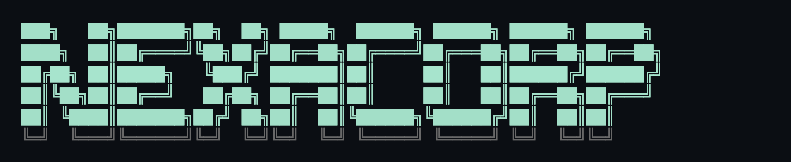

# Terminal Turmoil

A workplace mystery, played from a zsh-themed terminal.



## What it looks like

The game features command history, suggestions, and autocomplete. 


Coordinate with your friends and coworkers over Piper:


## Play Locally

```bash
npm run dev
```

## If your career goes sideways

Saves live in `localStorage`. To start over from scratch, in your browser devtools:

```js
localStorage.removeItem('terminal-turmoil-save'); location.reload();
```

### Spoilers!

The `docs/` directory holds the story flows. 